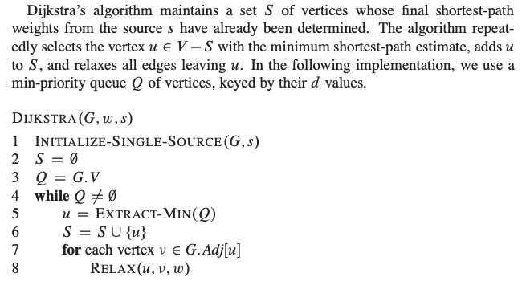
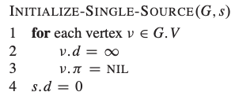
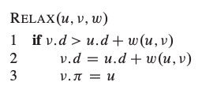

# Implementaion of basis algorithms and data structures

## C

Cormen Leiserson Rivest Stein CLRS - Introduction to Algorithms - 3rd Edition

- [Linked List](C/linked_list.h)
- [Binary Tree](C/binary_tree.h)
- [Heap](C/heap.h)
- [Graph](C/graph.h)
  - Dijkstra: Dijkstra's algorithm is an algorithm for finding the shortest paths between nodes in a graph which may represent, for example, road networks. It was conceived by computer scientist Edsger W. Dijkstra in 1956 and published three years later.
    
    
    

    Cormen, Thomas H., et al. "Introduction to Algorithms (3-rd edition)." MIT Press and McGraw-Hill (2009).

Running the following command loads the edges from ../Data/Graph/dh_stanford_edges.csv, builds a graph and runs dijksta.

```
gcc graph.c && ./a.out
```

The program prints the adjacency lists and the result of dijkstra to the console.

```
---------------------------------
Vertex: 196
Shortest path estimate: inf
Predecessor:            -inf
---------------------------------
Vertex: 194
Shortest path estimate: inf
Predecessor:            -inf
---------------------------------
Vertex: 193
Shortest path estimate: inf
Predecessor:            -inf
---------------------------------
Vertex: 195
Shortest path estimate: inf
Predecessor:            -inf
---------------------------------
Vertex: 198
Shortest path estimate: inf
Predecessor:            -inf
---------------------------------
Vertex: 8
Shortest path estimate: inf
Predecessor:            -inf
---------------------------------
Vertex: 191
Shortest path estimate: inf
Predecessor:            -inf
---------------------------------
Vertex: 197
Shortest path estimate: inf
Predecessor:            -inf
---------------------------------
Vertex: 123
Shortest path estimate: 18.000000
Predecessor:            96.000000
---------------------------------
Vertex: 188
Shortest path estimate: 18.000000
Predecessor:            184.000000
---------------------------------
Vertex: 122
Shortest path estimate: 17.000000
Predecessor:            166.000000
---------------------------------
Vertex: 125
Shortest path estimate: 17.000000
Predecessor:            101.000000
---------------------------------
Vertex: 124
Shortest path estimate: 17.000000
Predecessor:            98.000000
---------------------------------
Vertex: 168
Shortest path estimate: 17.000000
Predecessor:            158.000000
---------------------------------
Vertex: 169
Shortest path estimate: 17.000000
Predecessor:            162.000000
---------------------------------
Vertex: 130
Shortest path estimate: 16.000000
Predecessor:            113.000000
---------------------------------
Vertex: 126
Shortest path estimate: 16.000000
Predecessor:            119.000000
---------------------------------
Vertex: 133
Shortest path estimate: 16.000000
Predecessor:            121.000000
---------------------------------
Vertex: 131
Shortest path estimate: 16.000000
Predecessor:            113.000000
---------------------------------
Vertex: 9
Shortest path estimate: 16.000000
Predecessor:            175.000000
---------------------------------
Vertex: 132
Shortest path estimate: 16.000000
Predecessor:            118.000000
---------------------------------
Vertex: 129
Shortest path estimate: 16.000000
Predecessor:            111.000000
---------------------------------
Vertex: 127
Shortest path estimate: 16.000000
Predecessor:            109.000000
---------------------------------
Vertex: 128
Shortest path estimate: 16.000000
Predecessor:            110.000000
---------------------------------
Vertex: 97
Shortest path estimate: 15.000000
Predecessor:            88.000000
---------------------------------
Vertex: 94
Shortest path estimate: 15.000000
Predecessor:            88.000000
---------------------------------
Vertex: 190
Shortest path estimate: 15.000000
Predecessor:            81.000000
---------------------------------
Vertex: 176
Shortest path estimate: 15.000000
Predecessor:            6.000000
---------------------------------
Vertex: 177
Shortest path estimate: 15.000000
Predecessor:            6.000000
---------------------------------
Vertex: 179
Shortest path estimate: 15.000000
Predecessor:            6.000000
---------------------------------
Vertex: 93
Shortest path estimate: 15.000000
Predecessor:            88.000000
---------------------------------
Vertex: 4
Shortest path estimate: 15.000000
Predecessor:            81.000000
---------------------------------
Vertex: 95
Shortest path estimate: 15.000000
Predecessor:            88.000000
---------------------------------
Vertex: 96
Shortest path estimate: 15.000000
Predecessor:            88.000000
---------------------------------
Vertex: 157
Shortest path estimate: 14.000000
Predecessor:            144.000000
---------------------------------
Vertex: 99
Shortest path estimate: 14.000000
Predecessor:            88.000000
---------------------------------
Vertex: 101
Shortest path estimate: 14.000000
Predecessor:            88.000000
---------------------------------
Vertex: 98
Shortest path estimate: 14.000000
Predecessor:            88.000000
---------------------------------
Vertex: 183
Shortest path estimate: 14.000000
Predecessor:            6.000000
---------------------------------
Vertex: 148
Shortest path estimate: 14.000000
Predecessor:            139.000000
---------------------------------
Vertex: 158
Shortest path estimate: 14.000000
Predecessor:            145.000000
---------------------------------
Vertex: 102
Shortest path estimate: 14.000000
Predecessor:            88.000000
---------------------------------
Vertex: 152
Shortest path estimate: 14.000000
Predecessor:            141.000000
---------------------------------
Vertex: 105
Shortest path estimate: 14.000000
Predecessor:            88.000000
---------------------------------
Vertex: 151
Shortest path estimate: 14.000000
Predecessor:            142.000000
---------------------------------
Vertex: 160
Shortest path estimate: 14.000000
Predecessor:            146.000000
---------------------------------
Vertex: 186
Shortest path estimate: 14.000000
Predecessor:            6.000000
---------------------------------
Vertex: 154
Shortest path estimate: 14.000000
Predecessor:            141.000000
---------------------------------
Vertex: 159
Shortest path estimate: 14.000000
Predecessor:            146.000000
---------------------------------
Vertex: 150
Shortest path estimate: 14.000000
Predecessor:            142.000000
---------------------------------
Vertex: 149
Shortest path estimate: 14.000000
Predecessor:            142.000000
---------------------------------
Vertex: 187
Shortest path estimate: 14.000000
Predecessor:            6.000000
---------------------------------
Vertex: 147
Shortest path estimate: 14.000000
Predecessor:            139.000000
---------------------------------
Vertex: 155
Shortest path estimate: 14.000000
Predecessor:            142.000000
---------------------------------
Vertex: 180
Shortest path estimate: 14.000000
Predecessor:            6.000000
---------------------------------
Vertex: 181
Shortest path estimate: 14.000000
Predecessor:            6.000000
---------------------------------
Vertex: 153
Shortest path estimate: 14.000000
Predecessor:            141.000000
---------------------------------
Vertex: 86
Shortest path estimate: 14.000000
Predecessor:            76.000000
---------------------------------
Vertex: 104
Shortest path estimate: 14.000000
Predecessor:            88.000000
---------------------------------
Vertex: 182
Shortest path estimate: 14.000000
Predecessor:            6.000000
---------------------------------
Vertex: 185
Shortest path estimate: 14.000000
Predecessor:            6.000000
---------------------------------
Vertex: 167
Shortest path estimate: 14.000000
Predecessor:            137.000000
---------------------------------
Vertex: 73
Shortest path estimate: 14.000000
Predecessor:            61.000000
---------------------------------
Vertex: 165
Shortest path estimate: 14.000000
Predecessor:            137.000000
---------------------------------
Vertex: 100
Shortest path estimate: 14.000000
Predecessor:            88.000000
---------------------------------
Vertex: 166
Shortest path estimate: 14.000000
Predecessor:            137.000000
---------------------------------
Vertex: 163
Shortest path estimate: 14.000000
Predecessor:            135.000000
---------------------------------
Vertex: 161
Shortest path estimate: 14.000000
Predecessor:            134.000000
---------------------------------
Vertex: 162
Shortest path estimate: 14.000000
Predecessor:            134.000000
---------------------------------
Vertex: 184
Shortest path estimate: 14.000000
Predecessor:            6.000000
---------------------------------
Vertex: 164
Shortest path estimate: 14.000000
Predecessor:            136.000000
---------------------------------
Vertex: 72
Shortest path estimate: 14.000000
Predecessor:            71.000000
---------------------------------
Vertex: 103
Shortest path estimate: 14.000000
Predecessor:            88.000000
---------------------------------
Vertex: 106
Shortest path estimate: 14.000000
Predecessor:            88.000000
---------------------------------
Vertex: 92
Shortest path estimate: 13.000000
Predecessor:            88.000000
---------------------------------
Vertex: 87
Shortest path estimate: 13.000000
Predecessor:            84.000000
---------------------------------
Vertex: 91
Shortest path estimate: 13.000000
Predecessor:            88.000000
---------------------------------
Vertex: 174
Shortest path estimate: 13.000000
Predecessor:            40.000000
---------------------------------
Vertex: 175
Shortest path estimate: 13.000000
Predecessor:            40.000000
---------------------------------
Vertex: 107
Shortest path estimate: 13.000000
Predecessor:            88.000000
---------------------------------
Vertex: 108
Shortest path estimate: 13.000000
Predecessor:            88.000000
---------------------------------
Vertex: 109
Shortest path estimate: 13.000000
Predecessor:            88.000000
---------------------------------
Vertex: 111
Shortest path estimate: 13.000000
Predecessor:            88.000000
---------------------------------
Vertex: 90
Shortest path estimate: 13.000000
Predecessor:            88.000000
---------------------------------
Vertex: 112
Shortest path estimate: 13.000000
Predecessor:            88.000000
---------------------------------
Vertex: 113
Shortest path estimate: 13.000000
Predecessor:            88.000000
---------------------------------
Vertex: 89
Shortest path estimate: 13.000000
Predecessor:            88.000000
---------------------------------
Vertex: 114
Shortest path estimate: 13.000000
Predecessor:            88.000000
---------------------------------
Vertex: 119
Shortest path estimate: 13.000000
Predecessor:            88.000000
---------------------------------
Vertex: 117
Shortest path estimate: 13.000000
Predecessor:            88.000000
---------------------------------
Vertex: 121
Shortest path estimate: 13.000000
Predecessor:            88.000000
---------------------------------
Vertex: 189
Shortest path estimate: 13.000000
Predecessor:            41.000000
---------------------------------
Vertex: 115
Shortest path estimate: 13.000000
Predecessor:            88.000000
---------------------------------
Vertex: 116
Shortest path estimate: 13.000000
Predecessor:            88.000000
---------------------------------
Vertex: 110
Shortest path estimate: 13.000000
Predecessor:            88.000000
---------------------------------
Vertex: 118
Shortest path estimate: 13.000000
Predecessor:            88.000000
---------------------------------
Vertex: 192
Shortest path estimate: 13.000000
Predecessor:            40.000000
---------------------------------
Vertex: 79
Shortest path estimate: 12.000000
Predecessor:            75.000000
---------------------------------
Vertex: 77
Shortest path estimate: 12.000000
Predecessor:            76.000000
---------------------------------
Vertex: 156
Shortest path estimate: 12.000000
Predecessor:            10.000000
---------------------------------
Vertex: 170
Shortest path estimate: 11.000000
Predecessor:            10.000000
---------------------------------
Vertex: 82
Shortest path estimate: 11.000000
Predecessor:            75.000000
---------------------------------
Vertex: 83
Shortest path estimate: 11.000000
Predecessor:            75.000000
---------------------------------
Vertex: 171
Shortest path estimate: 11.000000
Predecessor:            10.000000
---------------------------------
Vertex: 58
Shortest path estimate: 11.000000
Predecessor:            47.000000
---------------------------------
Vertex: 88
Shortest path estimate: 11.000000
Predecessor:            34.000000
---------------------------------
Vertex: 172
Shortest path estimate: 11.000000
Predecessor:            10.000000
---------------------------------
Vertex: 173
Shortest path estimate: 11.000000
Predecessor:            10.000000
---------------------------------
Vertex: 6
Shortest path estimate: 11.000000
Predecessor:            10.000000
---------------------------------
Vertex: 39
Shortest path estimate: 11.000000
Predecessor:            26.000000
---------------------------------
Vertex: 38
Shortest path estimate: 11.000000
Predecessor:            25.000000
---------------------------------
Vertex: 40
Shortest path estimate: 11.000000
Predecessor:            27.000000
---------------------------------
Vertex: 42
Shortest path estimate: 11.000000
Predecessor:            30.000000
---------------------------------
Vertex: 37
Shortest path estimate: 11.000000
Predecessor:            29.000000
---------------------------------
Vertex: 43
Shortest path estimate: 11.000000
Predecessor:            31.000000
---------------------------------
Vertex: 44
Shortest path estimate: 11.000000
Predecessor:            32.000000
---------------------------------
Vertex: 41
Shortest path estimate: 11.000000
Predecessor:            34.000000
---------------------------------
Vertex: 50
Shortest path estimate: 11.000000
Predecessor:            47.000000
---------------------------------
Vertex: 51
Shortest path estimate: 11.000000
Predecessor:            47.000000
---------------------------------
Vertex: 52
Shortest path estimate: 11.000000
Predecessor:            47.000000
---------------------------------
Vertex: 49
Shortest path estimate: 11.000000
Predecessor:            47.000000
---------------------------------
Vertex: 81
Shortest path estimate: 11.000000
Predecessor:            75.000000
---------------------------------
Vertex: 80
Shortest path estimate: 11.000000
Predecessor:            75.000000
---------------------------------
Vertex: 53
Shortest path estimate: 11.000000
Predecessor:            47.000000
---------------------------------
Vertex: 55
Shortest path estimate: 11.000000
Predecessor:            47.000000
---------------------------------
Vertex: 56
Shortest path estimate: 11.000000
Predecessor:            47.000000
---------------------------------
Vertex: 59
Shortest path estimate: 11.000000
Predecessor:            47.000000
---------------------------------
Vertex: 60
Shortest path estimate: 11.000000
Predecessor:            47.000000
---------------------------------
Vertex: 62
Shortest path estimate: 11.000000
Predecessor:            47.000000
---------------------------------
Vertex: 63
Shortest path estimate: 11.000000
Predecessor:            47.000000
---------------------------------
Vertex: 64
Shortest path estimate: 11.000000
Predecessor:            47.000000
---------------------------------
Vertex: 65
Shortest path estimate: 11.000000
Predecessor:            47.000000
---------------------------------
Vertex: 66
Shortest path estimate: 11.000000
Predecessor:            47.000000
---------------------------------
Vertex: 67
Shortest path estimate: 11.000000
Predecessor:            47.000000
---------------------------------
Vertex: 138
Shortest path estimate: 10.000000
Predecessor:            10.000000
---------------------------------
Vertex: 139
Shortest path estimate: 10.000000
Predecessor:            10.000000
---------------------------------
Vertex: 140
Shortest path estimate: 10.000000
Predecessor:            10.000000
---------------------------------
Vertex: 141
Shortest path estimate: 10.000000
Predecessor:            10.000000
---------------------------------
Vertex: 143
Shortest path estimate: 10.000000
Predecessor:            10.000000
---------------------------------
Vertex: 142
Shortest path estimate: 10.000000
Predecessor:            10.000000
---------------------------------
Vertex: 144
Shortest path estimate: 10.000000
Predecessor:            10.000000
---------------------------------
Vertex: 76
Shortest path estimate: 10.000000
Predecessor:            75.000000
---------------------------------
Vertex: 145
Shortest path estimate: 10.000000
Predecessor:            10.000000
---------------------------------
Vertex: 146
Shortest path estimate: 10.000000
Predecessor:            10.000000
---------------------------------
Vertex: 134
Shortest path estimate: 10.000000
Predecessor:            10.000000
---------------------------------
Vertex: 135
Shortest path estimate: 10.000000
Predecessor:            10.000000
---------------------------------
Vertex: 70
Shortest path estimate: 10.000000
Predecessor:            47.000000
---------------------------------
Vertex: 71
Shortest path estimate: 10.000000
Predecessor:            47.000000
---------------------------------
Vertex: 136
Shortest path estimate: 10.000000
Predecessor:            10.000000
---------------------------------
Vertex: 137
Shortest path estimate: 10.000000
Predecessor:            10.000000
---------------------------------
Vertex: 61
Shortest path estimate: 10.000000
Predecessor:            74.000000
---------------------------------
Vertex: 84
Shortest path estimate: 9.000000
Predecessor:            75.000000
---------------------------------
Vertex: 85
Shortest path estimate: 9.000000
Predecessor:            75.000000
---------------------------------
Vertex: 26
Shortest path estimate: 9.000000
Predecessor:            15.000000
---------------------------------
Vertex: 23
Shortest path estimate: 9.000000
Predecessor:            13.000000
---------------------------------
Vertex: 25
Shortest path estimate: 9.000000
Predecessor:            14.000000
---------------------------------
Vertex: 27
Shortest path estimate: 9.000000
Predecessor:            16.000000
---------------------------------
Vertex: 30
Shortest path estimate: 9.000000
Predecessor:            18.000000
---------------------------------
Vertex: 31
Shortest path estimate: 9.000000
Predecessor:            19.000000
---------------------------------
Vertex: 32
Shortest path estimate: 9.000000
Predecessor:            20.000000
---------------------------------
Vertex: 28
Shortest path estimate: 9.000000
Predecessor:            16.000000
---------------------------------
Vertex: 24
Shortest path estimate: 9.000000
Predecessor:            13.000000
---------------------------------
Vertex: 34
Shortest path estimate: 9.000000
Predecessor:            22.000000
---------------------------------
Vertex: 29
Shortest path estimate: 9.000000
Predecessor:            17.000000
---------------------------------
Vertex: 75
Shortest path estimate: 8.000000
Predecessor:            36.000000
---------------------------------
Vertex: 33
Shortest path estimate: 8.000000
Predecessor:            45.000000
---------------------------------
Vertex: 48
Shortest path estimate: 8.000000
Predecessor:            45.000000
---------------------------------
Vertex: 47
Shortest path estimate: 8.000000
Predecessor:            36.000000
---------------------------------
Vertex: 68
Shortest path estimate: 8.000000
Predecessor:            36.000000
---------------------------------
Vertex: 10
Shortest path estimate: 8.000000
Predecessor:            78.000000
---------------------------------
Vertex: 69
Shortest path estimate: 8.000000
Predecessor:            36.000000
---------------------------------
Vertex: 74
Shortest path estimate: 7.000000
Predecessor:            36.000000
---------------------------------
Vertex: 15
Shortest path estimate: 6.000000
Predecessor:            7.000000
---------------------------------
Vertex: 17
Shortest path estimate: 6.000000
Predecessor:            7.000000
---------------------------------
Vertex: 13
Shortest path estimate: 6.000000
Predecessor:            7.000000
---------------------------------
Vertex: 18
Shortest path estimate: 6.000000
Predecessor:            7.000000
---------------------------------
Vertex: 19
Shortest path estimate: 6.000000
Predecessor:            7.000000
---------------------------------
Vertex: 20
Shortest path estimate: 6.000000
Predecessor:            7.000000
---------------------------------
Vertex: 21
Shortest path estimate: 6.000000
Predecessor:            7.000000
---------------------------------
Vertex: 14
Shortest path estimate: 6.000000
Predecessor:            7.000000
---------------------------------
Vertex: 16
Shortest path estimate: 6.000000
Predecessor:            7.000000
---------------------------------
Vertex: 22
Shortest path estimate: 6.000000
Predecessor:            7.000000
---------------------------------
Vertex: 45
Shortest path estimate: 6.000000
Predecessor:            36.000000
---------------------------------
Vertex: 78
Shortest path estimate: 4.000000
Predecessor:            35.000000
---------------------------------
Vertex: 7
Shortest path estimate: 4.000000
Predecessor:            35.000000
---------------------------------
Vertex: 36
Shortest path estimate: 4.000000
Predecessor:            1.000000
---------------------------------
Vertex: 46
Shortest path estimate: 3.000000
Predecessor:            1.000000
---------------------------------
Vertex: 35
Shortest path estimate: 1.000000
Predecessor:            1.000000
---------------------------------
Vertex: 1
Shortest path estimate: 0.000000
Predecessor:            -inf
key, adjacency_list
196: 197,
197: 193, 196, 195,
195: 197,
194: 198,
198: 194, 193,
193: 197, 198,
9: 175, 174, 192,
192: 9, 40,
8: 191,
191: 8,
4: 190, 81, 189,
189: 41, 4,
188: 187, 184,
187: 188, 6,
186: 176, 6,
185: 177, 6,
184: 188, 6,
183: 179, 6,
182: 175, 6,
181: 52, 6,
180: 174, 6,
179: 183, 6,
177: 185, 6,
176: 186, 6,
175: 9, 182, 6, 173, 40,
174: 9, 180, 6, 173, 40,
6: 187, 186, 185, 184, 183, 182, 181, 180, 179, 52, 177, 176, 174, 175, 28, 10,
173: 175, 174, 10,
172: 10,
171: 10,
170: 10,
169: 162,
168: 158,
166: 122, 138, 137,
165: 122, 138, 137,
164: 136,
163: 135,
162: 169, 134,
161: 134,
167: 138, 137, 122,
160: 146,
159: 146,
158: 168, 145,
157: 144,
156: 10, 136, 134, 145, 144, 143,
155: 142,
154: 141,
153: 141,
152: 141,
151: 142, 140,
150: 142, 140,
149: 142, 140,
148: 139,
147: 139,
190: 87, 4, 81,
146: 160, 159, 10,
145: 158, 156, 10,
144: 157, 156, 10,
143: 156, 10,
142: 155, 151, 150, 149, 10,
141: 154, 153, 152, 24, 85, 10,
140: 151, 150, 149, 10,
139: 148, 147, 28, 10,
138: 167, 166, 165, 10,
137: 167, 166, 165, 10,
136: 164, 156, 10,
135: 163, 28, 10,
10: 6, 173, 172, 171, 170, 78, 28, 156, 146, 145, 144, 143, 142, 141, 140, 139, 138, 137, 136, 135, 134,
134: 162, 161, 156, 10,
133: 121,
132: 118,
131: 113,
130: 113,
129: 111,
128: 110,
127: 109,
126: 119, 105,
125: 101,
124: 98,
123: 96,
122: 165, 166, 167, 94, 102, 100,
121: 133, 88,
119: 126, 88,
118: 132, 88,
117: 88,
116: 88,
115: 88,
114: 88,
113: 131, 130, 88,
112: 88,
111: 129, 88,
110: 128, 88,
109: 127, 88,
108: 88,
107: 88,
106: 88,
105: 126, 88,
104: 88,
103: 88,
102: 122, 88,
101: 125, 88,
100: 122, 88,
99: 88,
98: 124, 88,
97: 88,
96: 123, 88,
95: 88,
94: 122, 88,
93: 88,
92: 88,
91: 88,
90: 88,
88: 121, 34, 119, 118, 117, 116, 115, 114, 113, 112, 111, 110, 109, 108, 107, 106, 105, 104, 103, 102, 101, 100, 99, 98, 81, 97, 96, 95, 94, 93, 92, 91, 90, 89,
89: 88,
87: 190, 83, 84,
77: 76,
76: 77, 75, 86,
86: 76,
85: 141, 75,
84: 87, 75,
83: 87, 75,
82: 75,
81: 4, 190, 88, 75,
80: 75,
79: 75,
78: 10, 35, 75,
75: 76, 85, 84, 83, 82, 81, 80, 79, 78, 36,
74: 36, 61,
73: 61,
71: 47, 59, 60, 56, 72,
72: 71,
70: 47, 60, 58, 55, 53,
69: 47, 67, 48, 53, 49, 36,
68: 47, 48, 36,
67: 69, 47,
66: 47,
65: 47,
64: 47,
63: 47,
62: 47,
61: 74, 73, 47,
60: 71, 70, 47,
59: 71, 47,
58: 70, 47,
56: 71, 47,
55: 70, 47,
53: 70, 69, 47,
52: 181, 40, 6, 47,
51: 47,
50: 47,
49: 69, 47,
47: 71, 70, 69, 68, 67, 66, 65, 64, 63, 62, 61, 60, 59, 58, 56, 55, 53, 52, 51, 50, 49, 36, 48,
48: 69, 68, 45, 47,
46: 1,
45: 36, 48, 33,
44: 32,
43: 31,
42: 30,
41: 189, 34, 28,
40: 192, 52, 175, 174, 27,
39: 26,
38: 25,
37: 29, 24, 23,
36: 75, 74, 69, 68, 45, 47, 1,
1: 46, 36, 35,
35: 78, 1, 7,
34: 88, 41, 22,
33: 45, 21,
32: 44, 20,
31: 43, 19,
30: 42, 18,
29: 37, 17,
28: 6, 10, 135, 139, 41, 16,
27: 40, 16,
26: 39, 15,
25: 38, 14,
24: 141, 37, 13,
23: 37, 13,
22: 34, 7,
21: 33, 7,
20: 32, 7,
19: 31, 7,
18: 30, 7,
17: 29, 7,
16: 28, 27, 7,
15: 26, 7,
14: 25, 7,
7: 35, 22, 21, 20, 19, 18, 17, 16, 15, 14, 13,
13: 24, 23, 7,
```

### Data

- Graph
  1. Weighted edges: https://dhs.stanford.edu/gephi-workshop/sample-graph-data/
